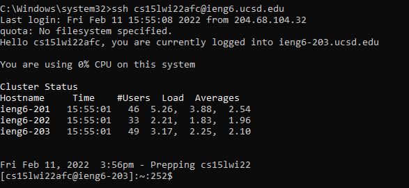
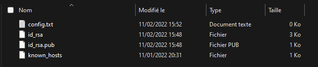
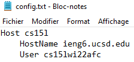
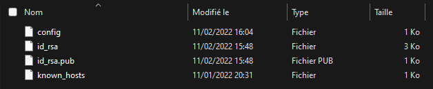
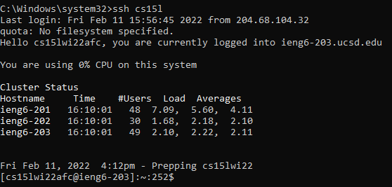

# Week 6: Lab Report 3

## Streamlining ssh Configuration
***
To be able to log onto the UCSD IENG6 servers without having to enter the long 
command that can be easily forgotten (ssh ```cs15lwi22???@ieng6.ucsd.edu```), 
you should set up a file in the ```.ssh``` directory to allow ssh to type in 
your username and the host name for you. The host name being 
```ieng6.ucsd.edu``` and the username being ```cs15lwi22???```. However, you 
may have to log in like this at the moment:

<p align="center">
    
</p>

Which is boring and not really memorable, so we should find a way to shorten 
this command and be able to log in easily.

First, find your .ssh directory. For Windows at least, it should be in the 
user's directory, and there should be a .ssh folder in there if you've already 
created an ssh key to connect to the servers without having to enter a password. 
Within that directory, create a file entitled config, without a file extension. 
You could also create it as a text file in order to edit the contents of it with 
notepad, but you should remove the extension after editing the file by renaming 
it to just ```config```.

<p align="center">
    
</p>

Afterwards, open the config file and edit it to have this:
```
Host ieng6
    HostName ieng6.ucsd.edu
    User cs15lwi22???
```
Replace the ```???``` with your name in the server and note that the 
```ieng6``` next to ```Host``` can be replaced with whatever you want to use to
log into the server. I will be using ```cs15l``` as an example that you can 
customise the name.

<p align="center">
    
</p>

Once you're done, this is what the config file should look like. Now make sure 
you saved and then rename the file to just ```config``` without the extension. 
Here's what it should look like in the directory now:

<p align="center">
    
</p>

Now it's pretty much complete. You can log onto the ieng6 servers without having
to enter, ```cs15lwi22???@ieng6.ucsd.edu```. Instead, just use the ```ssh``` 
command with the host title you chose. Because I chose ```cs15l```, I'll be 
using the command ```ssh cs15l```.

<p align="center">
    
</p>

