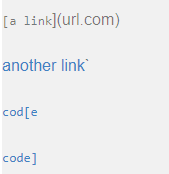
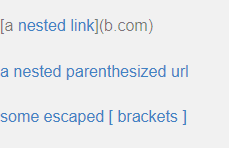
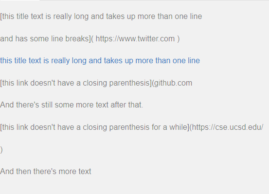
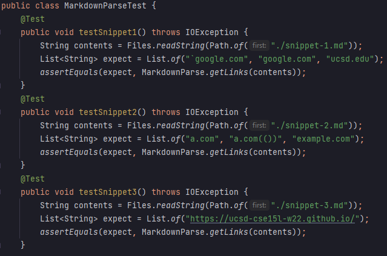
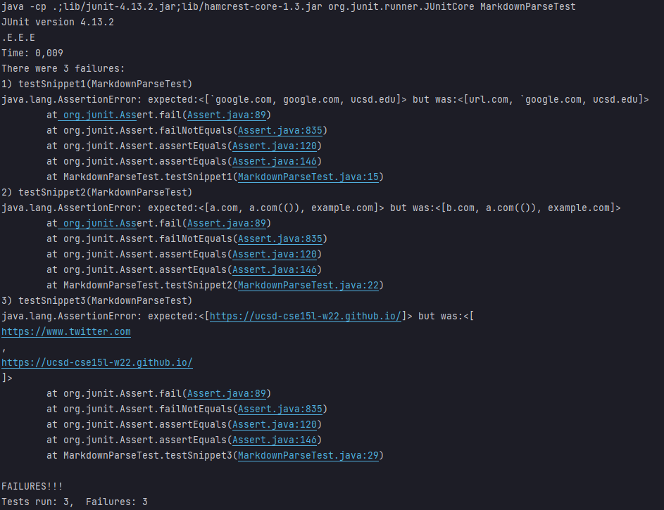
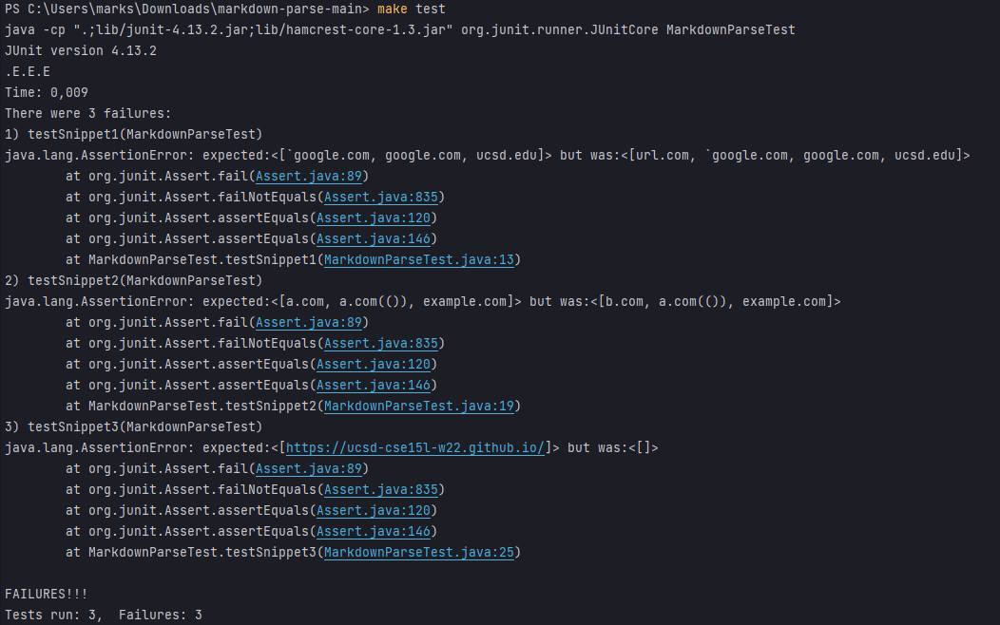

# Week 8: Lab Report 4

## Markdown Parse Testing
***
For lab report 4, there are three markdown snippets that will be used to test
our implementations of MarkdownParse. Those snippets being:

[Snippet 1](https://raw.githubusercontent.com/msioson/cse-15l-lab-reports/master/Screenshots/lab_report_4/snippet-1.md)

[Snippet 2](https://raw.githubusercontent.com/msioson/cse-15l-lab-reports/master/Screenshots/lab_report_4/snippet-2.md)

[Snippet 3](https://raw.githubusercontent.com/msioson/cse-15l-lab-reports/master/Screenshots/lab_report_4/snippet-3.md)

Since these snippets are being used to test our implementations of 
MarkdownParse, JUnit will be used to test them.

### My Implementation

[My Implementation of Markdown Parse](https://github.com/msioson/markdown-parse/tree/lab_report_4_snippets)

Resulting test of all three snippets:

None of the tests passed.

### Reviewed Implementation

[Reviewed Implementation of Markdown Parse](https://github.com/atruong39/markdown-parse)

Resulting test of all three snippets:

None of the tests passed as well.
