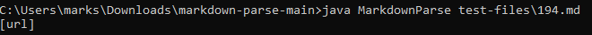

# Week 10: Lab Report 5
***

In this lab report, we will be discussing the differences between the group
implementation and course implementation of MarkdownParse. The tests were found
by running the bash script and selecting the files that led to the course 
implementation to return a link or more.


Expected outputs are to be retrieved from 
[here](https://spec.commonmark.org/dingus/), the reference CommonMark 
implementation.

## Test File 1: 194.md

The test file that we will be analysing is 
[194.md](Screenshots/lab_report_5/194.md) in both implementations of 
MarkdownParse. 
```
[Foo*bar\]]:my_(url) 'title (with parens)'

[Foo*bar\]]
```

### CSE15L Implementation: 


The output contains a link from within the first line of the Markdown file, 
returning the link from `[Foo*bar\]]:my_(url)`.

### Group Implementation:


The output from the group implementation of MarkdownParse returned nothing from 
the Markdown test file.

### Expected:


According to the reference CommonMark implementation, there was indeed an 
expected URL whose address should have been `my_(url)`, not just `url` or 
nothing. This is honestly quite interesting seeing that the `my_` part of it 
was not in the parentheses, however it is expected to be in there so in this 
regard, both implementations are wrong.

#### Potential Solution:

Given that the CSE15L implementation returned `url` from within the parentheses
even though separated from the brackets, the code should be fixed to have it 
account for the square brackets not directly preceding the parentheses and thus
not being considered link.


Although this method appears to find a closing parenthesis, it does not seem as 
though there is a way of determining if those sets of parentheses come right 
after a closing bracket, which could be where the possible solution would go.


## Test File 2: 342.md

The test file that we will be analysing is
[342.md](Screenshots/lab_report_5/342.md) in both implementations of
MarkdownParse.
```
[not a `link](/foo`)
```

### CSE15L Implementation:


As seen above, the output from running the course implementation of 
MarkdownParse on test file, 342.md, returns the only line in the file which
closely resembles the convention of a link in Markdown.

### Group Implementation:


Just like the course implementation, the output is the same. `/foo\``, now
whether this is expected should be asked.

### Expected:


Turns out, `/foo\`` should not even be returned at all, regardless of the 
implementation, resulting in it being a bug. Although the backticks are 
separated by the brackets and parentheses in the test file, they take 
precedence over the brackets and parentheses and should become a code block, 
hence no longer being a link.

#### Potential Solution:

Now as for a potential solution to this, we could have the code determine if 
any of the characters before or within the brackets and parentheses are 
backticks, a pair of them, which is indicative of inline code. Perhaps even a 
pair of three backticks, indicative of an entire code block, which should 
prevent whatever is in the parentheses from being included.


Currently, the group implementation does not account nor check for any form
of backticks, so that should be implemented to prevent content in 
bracket-parentheses from appearing within the returned list of links.
