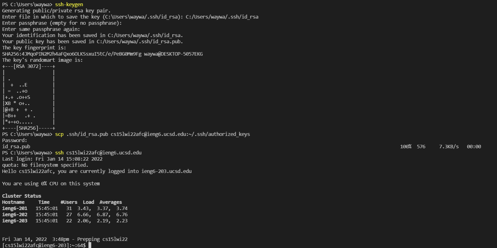

# Week 2 Lab Report

## Installing VSCode
***
In order to get [VSCode](https://code.visualstudio.com/), you must first access the website by clicking on the hyperlink 
or searching it up on your web browser. Second, once you are on the site, there should be a download button; it should
detect if you're on Mac, Windows, or Linux, but clicking on the arrow next to it should bring up different versions of 
installers that you can use for your operating system. 


Upon pressing it, you should be redirected to another part of their website and the download of the installer should 
start automatically. 


Once the download is done, open the installer and follow the steps it provides and it should be installed soon after.


[VSCode Redirect](https://code.visualstudio.com/)

## Connecting Remotely
***
To connect remotely to the CSE servers, OpenSSH will be used. For Windows, make sure that it is installed by following 
this [guide](https://docs.microsoft.com/en-us/windows-server/administration/openssh/openssh_install_firstuse).

Afterwards, determine which account you will be logging into on the servers by looking up the account name 
[here](https://sdacs.ucsd.edu/~icc/index.php). You will need your PID and username. When you press submit, it will take a few moments but the CSE server accounts should appear along with which courses they are associated with. If this does not work, try the second part where you will need your last name and PID. Logging on for the first time, it is suggested to reset your password for these accounts as well.


Once you get your CSE server account name for CSE15L, it should look like something along the lines of ```cs15lwi22???```
(for Winter quarter, 2022 that is), with the three question marks being your account name. Now open VSCode and then open 
a terminal, which can be done through the shortcut ``` command/ctrl + ` ```. Then use the ssh command to log in, 
```ssh cs15lwi22???@ieng6.ucsd.edu```. The ```@ieng6.ucsd.edu``` part is like an address for their servers. Trying to log 
on for the first time, it may point out how the authenticity of the host cannot be established. This only appears once 
and it's okay to disregard it by responding ```yes``` to it, however if it keeps appearing, the connection is most likely 
being altered in some way. Afterwards, it should prompt you to enter a password, so enter the password from when you 
reset it. It may look like nothing is being written down while typing, but that's normal. If issues arise, make sure you 
entered it correctly or wait a bit after resetting it, it takes a bit of time for changes to take place. To log out from 
the server, just use the command ```logout```.

This is what it should look like once you are logged in.


## Trying Some Commands
***
Now while you're connected to the server, here is a list of *some* commands you could run:
- ```cd```: stands for change directory, a command to change your current directory
- ```cd ~```: makes your current directory the home directory
- ```ls```: lists out the contents of your current directory
- ```ls -lat```: lists out the contents of your current directory with **hidden** directories and files included.
- ```ls <directory>```: lists out the contents of the directory provided
- ```cat <file directory>```: prints out the contents of the file
- ```mkdir```: creates a directory or directories
- ```logout```: logs you out of the servers 


## Moving Files with ```scp```
***
To copy files over with the ```scp``` command, you must first have the directory of the file(s) you want to copy, and the 
address you want to copy the files too. The command should look something like 
```scp File1.java cs5lwi22???@ieng6.ucsd.edu:~/```. If you want to copy multiple files over, you want the directory of 
those files to be separated with a space, all before the desired directory on the server. 
```scp File1.java File2.java cs15lwi22???@ieng6.ucsd.edu:~/```. Just like ```ssh```, the command will also prompt you to 
enter a password before copying the files over. It will also show the progress of copying the files over on the right.


## Setting an SSH Key
***
Setting up an SSH Key allows for students to log onto their accounts on the servers without having to enter a password. 
In order to actually do that however, the command ```ssh-keygen``` is used. Using this command on your computer, 
the client, generates a pair of public and private keys for your computer. When the command is run, it will ask the file 
in which to save the key, with a default in parentheses and that can be used just by not typing anything in and pressing 
enter. It will then ask for a passphrase, which should be left empty as that defeats the intention of having to not enter 
a password. Then use ```ssh```command to log onto the server and run the command ```mkdir``` to make a directory entitled 
```.ssh```, then log out. Now, use the command ```scp``` to copy the public ssh key to the .ssh directory on the server. 
The command should look something like: ```scp ./.ssh/id_rsa.pub cs15lwi22???@ieng6.ucsd.edu:~/.ssh/authorized_keys```.



## Optimising Remote Running 
*** 
For the last section, there are numerous ways to optimise remote running. One of those ways is to include command(s) that 
you intend to run on the server, in the ```ssh``` command to log in. Doing this allows you to log into the computer, run 
the command(s), then log out all in one command. For instance, ```ssh cs15lwi22???@ieng6.ucsd.edu "java WhereAmI"```. 
Doing this will give you the output of WhereAmI.java and then log you out. It's just like logging in, running the commands 
yourself, then logging out.

]

You can also use multiple arguments for most commands, and one of those commands is ```cat```.


Lastly, the up arrow can be used to automatically type out commands that you have already typed out and ran. One use case 
for this could be to upload a java file then compile and execute it on the server for testing all without having to type 
anything after the first time, just press up arrow and enter.

Another use case for this could be to make local edits on a file and then upload them onto the remote server to be 
executed. Once you have typed out the command to ```scp``` a file onto the remote servers and ```ssh``` to log in and 
execute in the same line as mentioned above, local edits can be uploaded in as little as six keystrokes (assuming you 
have also set up an SSH key on the remote server) by using the commands: ```scp <file> cs15lwi22???@ieng6.ucsd.edu``` 
and then ```ssh cs15lwi22???@ieng6.ucsd.edu "javac <file>.java; java <class in file>"```. Generally, the keystrokes are: 
(up, up, enter) two times, all into the terminal. This automatically types out the command before the last, executes it, 
then the last one you intend to execute. Overall, this took me approximately 4 seconds to upload a local change in a file,
upload it, then execute it on the remote server.