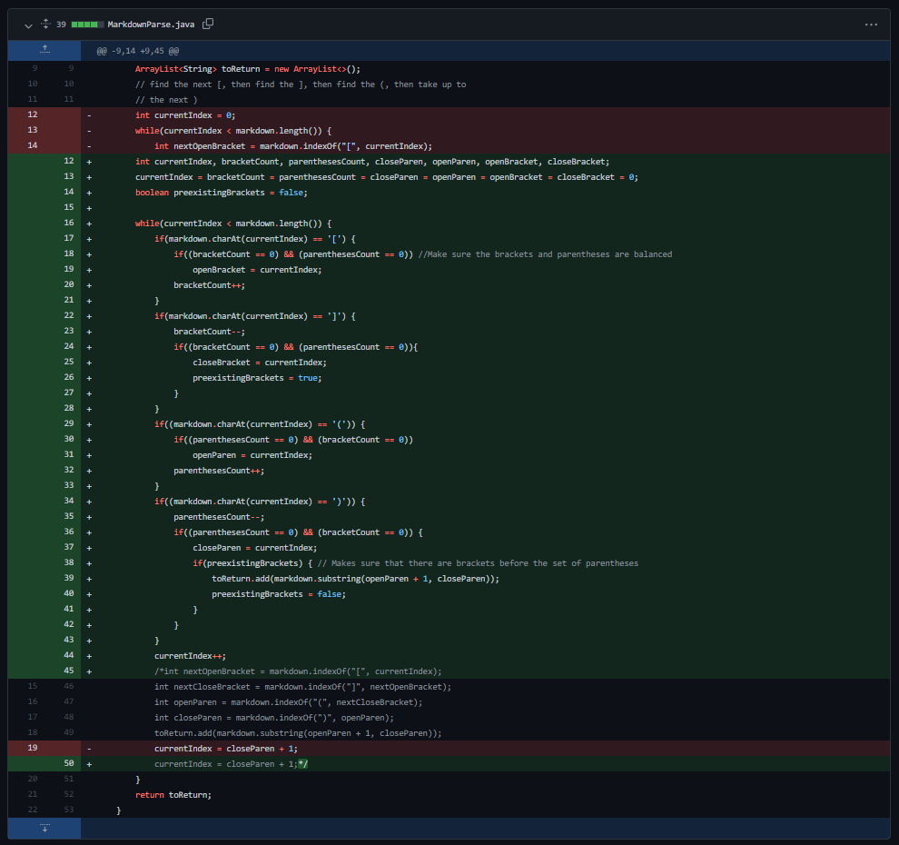
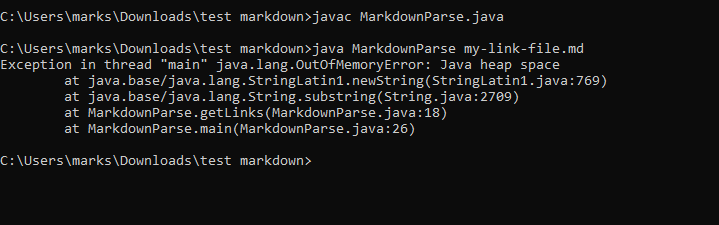
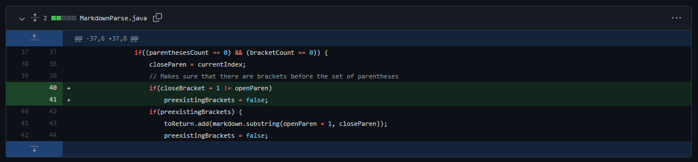
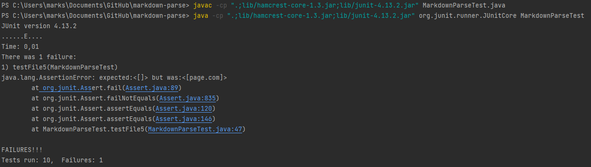

# Week 4: Lab Report 2


## Second Code Change
***
[](https://github.com/msioson/markdown-parse/commit/73678d33dc1583846189449fba83f3d9f2d8b295)

The symptom of the failure inducing input:

[Failure-inducing test file](https://github.com/msioson/markdown-parse/blob/73678d33dc1583846189449fba83f3d9f2d8b295/my-link-file.md)

The symptom of the failure-inducing test file was that it printed nothing from the file when it was expected to,
and it also prevented the user from entering anything into the command line or terminal before they were forced to press ```ctrl + c```.
The symptom was a result of a bug caused by a while loop in the code. The while loop would go on for longer than expected 
due to there being brackets in the link or URL name, which was not accounted for in the code.

This was resolved by ensuring that only the outer parentheses and brackets were counted and noted by making sure that 
they were balanced before storing their indices in the variables, and only the outer opening, closing parentheses and brackets.

## Third Code change
***
[](https://github.com/msioson/markdown-parse/commit/37b1365f3e1dec9eb19965255544771d099e9aa4)

The symptom of the failure inducing input:

[Failure-inducing test file](https://github.com/msioson/markdown-parse/blob/37b1365f3e1dec9eb19965255544771d099e9aa4/test-file5.md)

The symptom of the failure-inducing test file was that it printed ```page.com``` when it was not supposed to. Brackets, 
where the link name should have gone, did not precede the parentheses where ```page.com``` was, and due to this not being 
proper Markdown notation, it was not supposed to print it. This was a result of a bug in the code which failed to check
if brackets came before the parentheses in exactly a difference of one index.

This was resolved by making sure that, following proper Markdown formatting, the closing bracket came right before the
opening parentheses, signalling the existence of a link to be noted and stored in the ArrayList of links.